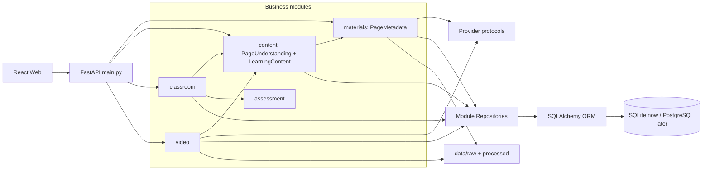
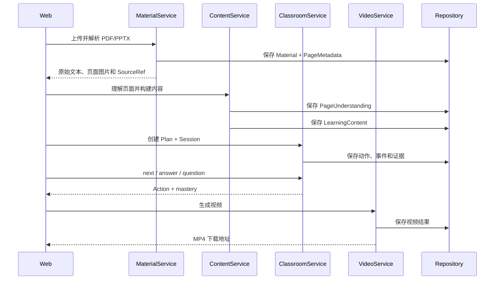

# MetaClass 架构说明

## 1. 当前形态

MetaClass 当前是一个模块化单体：一个 FastAPI 进程提供 API 和构建后的 React 页面，一个 SQLite 文件保存结构化记录，本地 `data/` 保存原始材料和生成产物。



源文件见 [`architecture.mmd`](architecture.mmd)。



## 2. 依赖规则

允许的依赖方向：

```text
main.py
  → modules/*/api.py
  → modules/*/service.py
  → infrastructure 接口/实现
  → SQLite、本地文件、第三方工具
```

必须遵守：

1. `api.py` 只处理 HTTP，不写业务规则。
2. `service.py` 不导入 FastAPI 的 `Request`、`Response`。
3. `schemas.py` 只放可校验的数据结构，不执行 I/O。
4. 业务模块不能直接读取另一个模块的 SQLite 记录，应调用对方 service。
5. 厂商 SDK 只出现在 `infrastructure/providers`，业务层依赖 Protocol。
6. `main.py` 只负责创建应用、装配依赖和挂载路由/静态页面。

## 3. 主流程



## 4. 当前技术债

解析与理解严格分层：`materials` 只产生确定性的 PageMetadata；`content` 调用 LearningProvider 产生可重新生成的 PageUnderstanding，再构建 LearningContent。更换模型或 Prompt 不需要重新解析文件。

- 每个业务域拥有独立 Repository Protocol 和 SQLAlchemy 实现，Service 不接触数据库 API。
- 当前使用 SQLite 正式表；可查询字段使用普通列，强类型嵌套对象使用 JSON 列并在读写时经过 Pydantic 校验。
- Repository 统一使用事务上下文，正常提交、异常回滚；应用退出时由 FastAPI lifespan 释放 Engine。
- SQLite 连接显式开启外键约束；新建表的页面编号、学习内容版本及视频进度受数据库约束保护，旧 MVP 数据库会自动补齐新增列和唯一索引。
- 当前通过 `Base.metadata.create_all` 初始化开发库；表结构开始演进后应立即引入 Alembic migration。
- 解析、视频生成目前同步执行；材料变大后应迁入 `jobs` worker。
- `FakeLearningProvider` 只做截断和简单词提取，不是模型理解。
- `FakeTTSProvider` 生成测试音轨，不是真实语音。
- 前端流程仍集中在 `App.tsx`，新页面应继续向 `features/` 拆分。
