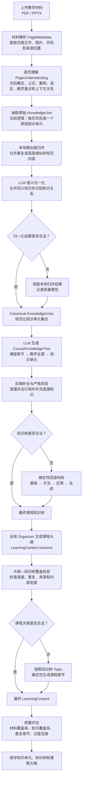

# 知识树与课程大纲生成原理链路

> 本文说明 MetaClass 当前从教学材料生成知识单元、课程知识树和课程大纲（`LearningContent.sections`）的实际流程。

## 一、核心结论

当前系统不是先生成独立大纲，再根据大纲构建知识树，而是按照以下顺序执行：

```text
教学材料
  → 页面解析
  → 逐页内容理解
  → 原始知识单元
  → 知识归一化
  → 课程知识树
  → 基于知识树生成课程大纲
  → 质量检查与保存
```

知识树负责回答“课程应该按照什么结构组织”，课程大纲负责回答“这些知识具体应该怎么讲”。

## 二、完整流程图



## 三、各阶段原理

### 1. 材料解析

教师上传 PDF、PPTX 等材料后，系统将材料解析成页面级数据 `PageMetadata`，主要包括：

- 页面文字；
- 页面图片和内嵌图片；
- 材料编号与页码；
- 原始内容来源 `SourceRef`。

这一阶段负责为后续生成提供可以追溯的事实依据。

### 2. 逐页内容理解

学习内容智能体结合当前页面、前后页面上下文以及可选的视觉信息，生成 `PageUnderstanding`，识别：

- 页面角色与内容摘要；
- 核心概念和可教学知识点；
- 公式、案例和证明；
- 常见误区和测验问题；
- 页面之间的依赖与主题关系。

系统已有完整页面理解结果且页面数量一致时，可以复用已有结果。

### 3. 原始知识单元抽取

当前实现会先根据每份 `PageUnderstanding` 形成一个原始 `KnowledgeUnit`。知识单元保留 `source_refs`、`page_refs` 和原始单元编号，从而在合并之后仍能追溯到材料原页。

知识单元标题的选择顺序为：

1. 第一个可教学点；
2. 第一个知识点；
3. 页面标题。

### 4. 知识归一化

知识归一化分为两层：

1. **本地相似度归并**：根据标题和关键词相似度，初步合并重复内容；
2. **LLM 语义归一化**：进一步识别同义知识、概念边界以及知识单元之间的关系。

后端会检查：

- 分组编号是否重复；
- 是否引用不存在的知识单元；
- 同一个知识单元是否进入多个分组；
- 组间关系是否合法。

如果语义归一化失败，系统不会直接丢弃知识，而是保留本地归并结果并记录质量警告。

### 5. 课程知识树生成

模型根据规范化后的知识单元生成 `CourseKnowledgeTree`，将知识组织为“课程章节—教学主题—知识单元”的层级结构，并表达基本教学顺序和前置关系。

后端随后执行补全和校验：

- 删除不存在的知识单元引用；
- 清理重复分配；
- 将遗漏知识自动补入附加节点；
- 校验节点、父子关系和前置关系；
- 确保每个知识单元都被覆盖；
- 确保一个知识单元只能出现在一个位置。

如果模型结果仍不合法，系统会按照“基础概念、方法与公式、案例与应用、总结与参考”等类别生成确定性的回退知识树。

### 6. 课程大纲生成

知识树完成后，全局 Organizer 才开始生成课程大纲。当前系统中的课程大纲主要对应 `LearningContent.sections`，并不是另一个独立持久化的 Outline 实体。

生成大纲时会综合使用：

- 原始材料页面；
- 页面理解结果；
- 规范化知识单元；
- 最终知识树；
- 教学目标与来源证据。

每个章节可以包含：

- 章节标题与教学目标；
- 内容摘要和核心知识点；
- 教师讲解内容；
- 公式、案例与易错点；
- 互动问题和测验；
- 与下一章节之间的过渡；
- 对应知识树节点与材料来源。

### 7. 大纲覆盖校验与回退

知识树是课程大纲的权威结构约束。后端会检查：

- 每个承载知识的 Topic 是否被大纲完整覆盖；
- 同一个 Topic 是否被多个章节重复引用；
- 章节是否保留材料来源；
- 单个章节是否合并了过多知识；
- 是否存在知识遗漏或过度压缩。

如果 Organizer 生成的大纲不符合要求，系统会按照知识树的 Topic 确定性生成章节，保证知识结构不丢失。

### 8. 质量评估与保存

最终质量层会检查：

- 材料覆盖率；
- 知识单元覆盖率；
- 未进入知识树的孤立单元；
- 重复章节标题；
- 没有来源证据的章节；
- 章节知识密度；
- 低置信度合并和知识关系；
- 跨材料内容冲突。

检查完成后，系统统一保存 `LearningContent`、规范化知识单元和课程知识树。

## 四、核心设计思想

> 材料负责提供事实依据，知识单元负责沉淀教学内容，知识树负责确定课程结构，课程大纲负责完成教学化表达；模型负责语义理解和组织，后端负责完整性校验与稳定兜底。

该设计有以下特点：

1. **来源可追溯**：知识单元和课程章节保留原材料页码与证据；
2. **按语义组织**：不机械采用“一页材料对应一个章节”的结构；
3. **知识树优先**：先确定知识结构，再进行教学化编排；
4. **模型与规则协同**：模型负责语义判断，后端负责硬约束；
5. **失败可回退**：模型结果不合法时使用确定性结构继续流程。

## 五、与 PresentationPlan 的边界

`PresentationPlan` 是课程大纲保存完成后的下游阶段。它读取 `LearningContent.sections`，规划 PPT 的页面数量、顺序、标题、要点、讲稿和视觉建议。

因此三者的关系是：

```text
CourseKnowledgeTree
        ↓ 约束课程结构
LearningContent.sections
        ↓ 约束 PPT 内容规划
PresentationPlan
        ↓ 约束最终 PPT 生成
PPTX
```

`PresentationPlan` 不会反过来生成或修改知识树和课程大纲。

## 六、汇报稿

下面介绍一下 MetaClass 从教学材料生成知识树和课程大纲的整体原理。

首先，教师上传 PDF、PPTX 等教学材料后，系统会对材料进行解析，提取每一页的文字、图片、页码以及对应的来源位置。随后，学习内容智能体会进行逐页理解。这里并不是简单读取文字，而是进一步识别页面中的核心概念、公式、案例、易错点、教学重点，以及前后页面之间的上下文关系，形成结构化的页面理解结果。

在页面理解的基础上，系统会抽取原始知识单元。当前实现是每一页先形成一个原始知识单元，同时保留材料编号、页码和原文证据。由于不同页面之间可能存在内容重复、概念相近或者表述方式不同的情况，系统会先进行本地相似度归并，再调用大模型完成语义层面的知识归一化，将同义或者高度相关的内容合并，并识别知识单元之间的关联、依赖和递进关系。

完成知识归一化后，系统不会立刻生成课程大纲，而是先根据规范化的知识单元构建课程知识树。知识树负责表达课程章节、教学主题和具体知识点之间的层级关系，同时描述基本的教学顺序和前置依赖。

模型生成知识树以后，后端还会进行严格校验，包括检查节点是否合法、知识单元是否遗漏、同一个知识单元是否被重复分配，以及父子关系和前置关系是否正确。对于模型遗漏的知识，系统会自动补充；如果模型结果仍然不符合约束，系统会按照基础概念、方法原理、案例应用和总结拓展等类别，生成一棵确定性的回退知识树，保证流程能够继续。

知识树确定以后，系统才会生成课程大纲，也就是 `LearningContent` 中的章节结构。在这个阶段，知识树是课程大纲的权威结构约束。大纲生成不再机械采用“一页材料对应一个章节”的方式，而是按照知识之间的教学逻辑，重新组织章节标题、教学目标、核心内容、教师讲解、公式、案例、易错点、互动问题以及章节之间的过渡。

大纲生成完成后，后端会再次检查每个知识树主题是否被完整覆盖，是否存在重复引用，章节是否保留了材料来源，以及是否把过多知识压缩到了同一个章节中。如果模型生成的大纲不符合要求，系统会直接按照知识树中的 Topic 确定性生成课程章节。

最后，系统会评估材料覆盖率、知识覆盖率和章节结构合理性，并统一保存知识单元、知识树和课程大纲。课程大纲保存完成后，后续的 `PresentationPlan` 才会读取这些章节并规划 PPT 的页数、顺序、标题、要点和讲稿。

因此，这条链路的核心可以概括为：材料负责提供事实依据，知识单元负责沉淀教学内容，知识树负责确定课程结构，课程大纲负责完成教学化表达；模型负责语义理解和组织，后端负责完整性校验与稳定兜底。

## 七、改进建议

当前链路已经具备知识追溯、结构校验和确定性回退能力，但在生成质量、教师控制力和结果稳定性方面仍有提升空间。

### P0：优先改进

#### 1. 从“每页一个知识单元”升级为语义级知识单元抽取

当前知识单元首先按照页面生成，仍然容易受到原材料分页方式影响。建议改为：

- 一页可以拆分出多个独立知识单元；
- 跨页连续讲解的内容可以合并为一个知识单元；
- 定义、公式、方法步骤、案例和结论分别识别；
- 合并后继续保留完整的材料页码和原文证据。

这一改进能够从源头提升知识树和课程大纲的结构质量。

#### 2. 增加“知识单元—知识树—大纲章节”覆盖台账

为每个知识单元保存并展示完整映射关系：

| 知识单元 | 来源材料 | 知识树节点 | 大纲章节 | 处理方式 |
|---|---|---|---|---|
| GWR 基本原理 | 第 2—3 页 | 基础原理 | 第二章 | 重组讲解 |
| 带宽选择 | 第 4 页 | 参数优化 | 第三章 | 拆分并扩展 |
| 模型评价指标 | 第 6 页 | 结果评价 | 第五章 | 保留并增加案例 |

处理方式可以包括保留、合并、拆分、调整顺序、补充案例和拓展讲解。这样教师可以直接判断内容如何从原材料转化到课程大纲，而不需要逐段人工对比。

#### 3. 增加章节锁定和局部重新生成

教师确认某些章节后，应允许将其锁定。后续调整大纲时，只重新生成指定章节，不能修改已经确认的内容。建议支持：

- 锁定章节；
- 拆分或合并章节；
- 拖拽调整顺序；
- 只重新生成选中章节；
- 对比修改前后版本；
- 回退到历史版本。

这能够避免当前“生成不满意只能整套重来”的问题。

### P1：教学编排能力改进

#### 4. 增加大纲生成参数

生成前由教师设置：

- 授课对象和基础水平；
- 教学目标和课程类型；
- 课程总时长；
- 内容深度；
- 预计章节数量；
- 理论、案例与实践的比例；
- 必须讲、可以拓展和可以弱化的知识点。

这些参数应作为知识树排序和大纲组织的显式条件，从而减少同一份材料多次生成时的随机差异。

#### 5. 将大纲生成拆成两个阶段

第一阶段生成“覆盖型大纲”，只负责保证所有知识单元都得到合理安排。

第二阶段生成“教学化大纲”，在不丢失知识的前提下完成：

- 教学顺序调整；
- 复杂内容分步讲解；
- 案例、问题和互动补充；
- 章节导入与过渡生成；
- 根据学生水平调整表达深度。

两阶段生成能够同时兼顾内容完整性和教学表达质量。

#### 6. 使用复杂度预算进行章节拆分与合并

当前主要依靠知识单元数量限制章节容量，建议进一步计算：

- 预计讲解时间；
- 概念与公式复杂度；
- 案例和实践任务数量；
- 前置知识数量；
- 学生理解难度。

章节超过复杂度预算时自动拆分，内容较少且教学关系紧密时才允许合并。这样能够减少章节内容过密和知识被过度压缩的问题。

### P2：稳定性与质量闭环

#### 7. 将质量警告升级为自动修复

当前部分质量问题只记录为 warning。建议形成以下闭环：

```text
生成
  → 覆盖检查
  → 顺序检查
  → 密度检查
  → 自动修复
  → 再次校验
```

例如：

- 发现知识遗漏时，自动补入对应章节；
- 发现章节过密时，自动拆分；
- 发现知识重复时，保留教学位置最合理的一处；
- 发现前置知识顺序错误时，自动调整章节顺序；
- 章节没有来源证据时，拒绝保存并重新生成。

#### 8. 改进语义归一化的局部容错

当大模型把同一个知识单元放进多个分组时，不应放弃整次语义归一化结果。可以根据分组置信度、主题相似度和知识关系，保留最合理的分组，只对冲突单元进行局部修复。

这样能够避免因为单个分组错误而整体退回本地相似度归并结果。

#### 9. 增加版本管理与幂等保存

每次重新生成应形成明确版本，并记录：

- 使用的模型和提示词版本；
- 教师输入的生成参数；
- 对应的材料与知识树版本；
- 自动修改和人工修改的章节；
- 内容覆盖率和质量检查结果。

数据库保存应采用安全的版本递增或幂等更新机制，避免重复任务触发版本唯一约束错误。

## 八、建议实施顺序

建议首先完成以下三项：

1. 语义级知识单元抽取；
2. 知识单元—知识树—大纲章节覆盖台账；
3. 章节锁定、局部修改和局部重新生成。

这三项能够直接提升知识结构质量、结果可解释性和教师控制力。随后再增加生成参数、两阶段大纲和复杂度预算，最后完善自动修复与版本管理。
