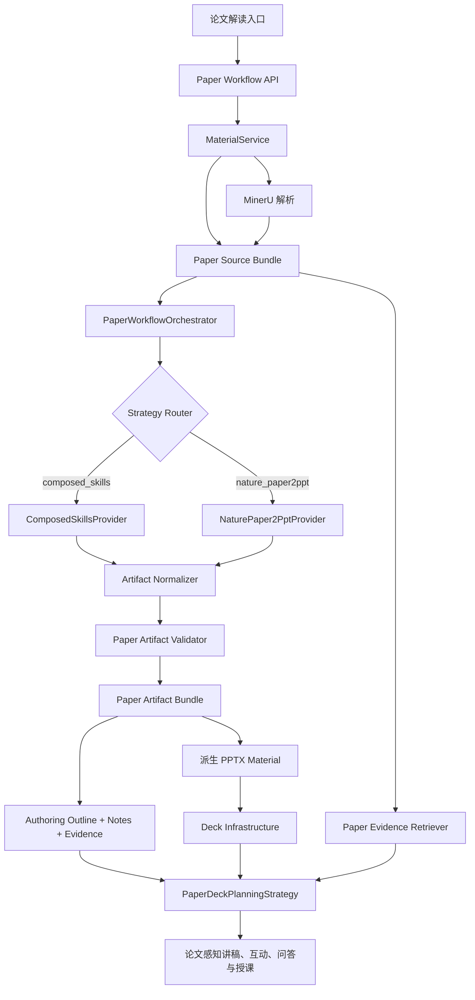
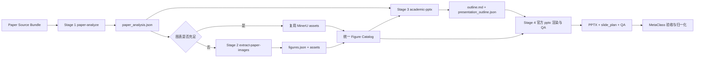
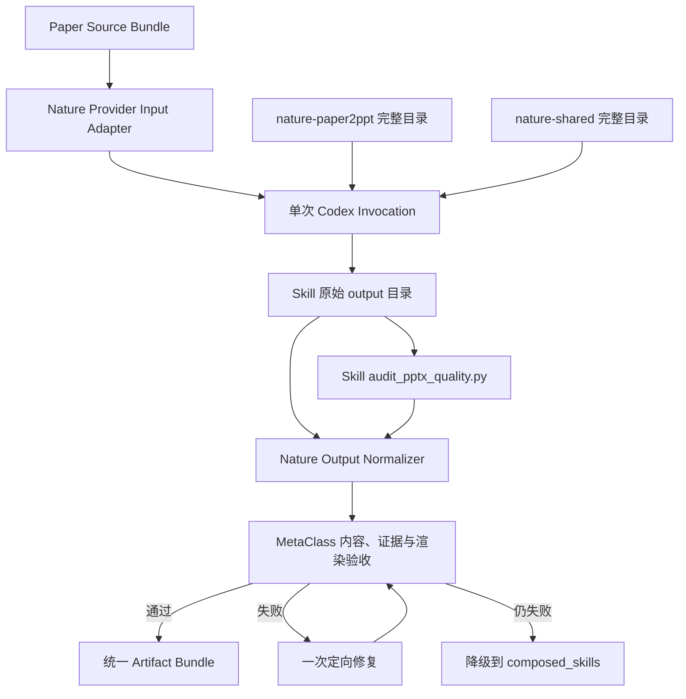
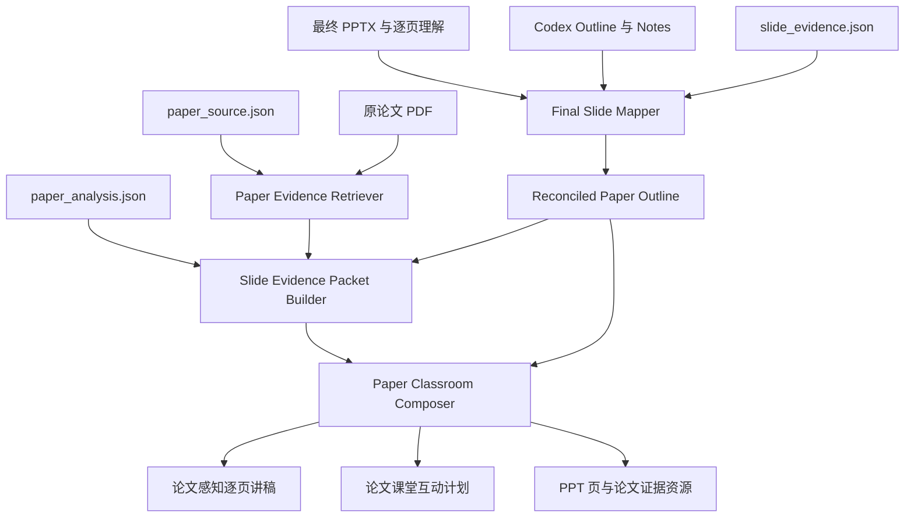

# MetaClass 论文解读、论文 PPT 与互动课堂双路线设计

> 状态：设计稿 v3，替换此前“固定四 Skill 串联”方案  
> 范围：单篇论文上传、论文解析、论文解读、论文 PPT 生成、论文感知讲稿、课堂互动与授课  
> 核心决策：保留“多 Skill 可控编排”作为基础能力，同时引入 `nature-paper2ppt` 作为端到端实验路线；二者输出同一份 MetaClass Artifact Bundle。生成后的论文 PPT 不完整套用 `source_deck`，而进入专用 `paper_deck` 模式：复用 Deck 基础设施，同时结合最终 PPT、Codex 生成意图和论文原文证据生成讲稿与互动。

---

## 1. 结论摘要

论文入口不绑定唯一 Skill，也不重新实现第三方 Skill 的内部逻辑。MetaClass 增加一个论文工作流层，提供两种生成策略：

1. **多 Skill 编排模式 `composed_skills`**
   - `paper-analyze`
   - `extract-paper-images`（按需）
   - `academic-pptx`
   - Anthropic 官方 `pptx`
   - 适合强调中间结果、证据追踪、可恢复性和精细控制的任务。

2. **端到端模式 `nature_paper2ppt`**
   - 完整调用 `nature-paper2ppt` 及其依赖的 `nature-shared`。
   - 不拆解或重写该 Skill，而是在外层提供输入包、业务约束、输出适配和验收。
   - 适合快速生成一份完整中文论文汇报 PPT，首版标记为 Beta/实验性。

两种策略都必须：

- 使用 MetaClass 的 MinerU 结构化结果，同时保留原 PDF；
- 产出真实 PPTX，而不是只产出 Markdown 大纲；
- 产出统一的论文分析、大纲、逐页证据、资产清单和 QA 信息；
- 将最终 PPTX 注册为派生 Material；
- 进入新增的 `paper_deck` 课堂规划流程；
- 复用现有 `source_deck` 的页面解析、资源、顺序校验、播放和讲稿绑定基础能力；
- 不复用其“只看 PPT 反推全部教学内容”的假设；
- 保留 Codex 生成时的大纲和 notes，按最终 PPT 校准，并用论文原文证据增强；
- 生成论文特有的图表阅读、方法理解、批判性分析和迁移互动。

`present-paper` 暂不接入。它虽然可以处理一般 academic presentation，但分析模板、补充检索、讲稿细节和视觉模板仍明显以临床研究、患者、RCT/cohort、PMID、效应量、药名发音和 grand rounds 为中心。未来若增加医学 Journal Club 专门入口，再作为独立 Provider 评估，不插入当前两条通用路线。

---

## 2. 产品入口与用户流程

### 2.1 新入口

在“正常讲课”之外增加一个“论文解读”入口。点击后直接执行完整的论文讲解流程，不再要求用户在“只做精读”和“生成 PPT 并讲解”之间选择：

```text
创建课程
├── 普通资料讲课
├── 使用原 PPT 讲课
└── 论文解读
```

“论文解读”的产品语义固定为：

```text
上传论文
→ 分析论文
→ 生成论文汇报 PPT
→ 结合论文原文生成讲稿与互动
→ 进入论文课堂
```

多 Skill 和 `nature-paper2ppt` 是系统内部实现策略，不再作为入口下的两个产品子模式。普通用户只看到统一的论文解读体验；调试、灰度和管理后台可以保留 Provider 指定能力。

内部路由首版采用：

```text
管理后台或实验配置明确指定 → 使用指定 Provider
正式/可审核/需要稳定中间结果 → composed_skills
允许 Beta 且命中灰度实验 → nature_paper2ppt
nature_paper2ppt 失败或验收不通过 → composed_skills
```

### 2.2 用户输入

初始入口只要求一项：

- 论文 PDF。

普通用户不需要在上传前填写汇报时长、目标听众、语言、深度、模板或生成策略。系统默认生成中文、标准深度、包含 speaker notes 和课堂互动的论文讲解。

只有内部路由选中 `nature_paper2ppt` 时，UI 才弹出一个最小补充设置框，并要求：

- 汇报时长；
- 目标听众。

```text
上传论文
→ 系统解析并选择 Provider
├── composed_skills：直接继续
└── nature_paper2ppt：弹出“完善汇报设置”
    ├── 汇报时长
    └── 目标听众
```

这个弹窗不增加其他问题。用户提交后继续同一个 job，不重新上传或重新解析论文；用户关闭弹窗时 job 保持等待，可以稍后继续或主动切换到标准路线。

管理员、调试和灰度配置可以覆盖 Provider，但不改变普通用户初始只上传论文的交互。

### 2.3 用户可见阶段

```text
1. 解析论文
2. 选择生成路线
3. 完善汇报设置（仅 nature-paper2ppt）
4. 分析论文
5. 准备论文图表
6. 规划汇报结构
7. 生成并校验 PPT
8. 对齐最终 PPT 与论文证据
9. 生成论文感知讲稿与互动
10. 完成
```

`composed_skills` 跳过第 3 步；UI 不显示一个短暂的“已跳过”页面。不同 Provider 内部步骤可以不同，外部使用同一组阶段语义。

---

## 3. 总体架构



### 3.1 新模块建议

```text
apps/api/src/metaclass/modules/paper_workflow/
├── api.py
├── schemas.py
├── models.py
├── repository.py
├── service.py
├── orchestrator.py
├── source_bundle.py
├── artifact_normalizer.py
├── validators.py
├── prompts/
│   ├── common_constraints.md
│   ├── paper_analyze_contract.md
│   ├── extract_figures_contract.md
│   ├── academic_outline_contract.md
│   ├── academic_generate_contract.md
│   ├── nature_paper2ppt_contract.md
│   ├── artifact_repair.md
│   └── outline_reconciliation.md
└── providers/
    ├── base.py
    ├── composed_skills.py
    └── nature_paper2ppt.py
```

不要把论文逻辑塞进现有 `CodexPPTProvider`。当前 `CodexPPTProvider` 的职责是根据已经冻结的 `PresentationPlan` 做视觉设计，并验证内容未被篡改；论文工作流需要读 PDF、调用多个 Skill、产生多个文件和支持阶段恢复，生命周期不同。类似地，不要把 `paper_deck` 作为几个 if 分支硬塞进 `source_deck` Prompt；应抽取共用 Deck 基础设施，并使用独立规划策略。

### 3.2 Provider 接口

```python
class PaperPresentationProvider(Protocol):
    name: str

    def run(
        self,
        *,
        request: PaperWorkflowRequest,
        source_bundle: PaperSourceBundle,
        workspace: Path,
        progress: PaperProgressReporter,
        resume_from: PaperWorkflowCheckpoint | None = None,
    ) -> RawPaperArtifacts: ...
```

Orchestrator 只依赖该接口，不知道具体 Skill 的内部文件结构。

---

## 4. 统一领域模型与存储

### 4.1 PaperWorkflowRequest

```json
{
  "material_id": "mat_source_pdf",
  "strategy": "auto",
  "duration_minutes": null,
  "audience": null
}
```

约束：

- `strategy`: `auto | composed_skills | nature_paper2ppt`；
- 普通用户创建请求时 `strategy=auto`，不展示该字段；
- `duration_minutes` 和 `audience` 初始允许为空；
- `composed_skills` 不因这两个字段为空而暂停，使用服务端默认 presentation profile；
- `nature_paper2ppt` 选中后，这两个字段变为必填，缺失时 job 进入 `waiting_for_input`；
- `duration_minutes`: 补充时允许 5–120；
- 默认 presentation profile 为中文、标准深度、15 分钟、具备基础专业背景的高校学生/研究生听众；它只服务无需弹窗的标准路线；
- 页数只作为建议，不作为硬编码，约为 `duration_minutes × 0.6–0.9`；
- 联网默认关闭，避免外部资料污染“解读当前论文”的证据边界；
- speaker notes、批判性分析和课堂互动默认开启；附录和自定义模板默认关闭。

### 4.2 PaperWorkflowJob

```json
{
  "id": "paper_job_xxx",
  "source_material_id": "mat_xxx",
  "strategy_requested": "auto",
  "strategy_selected": "nature_paper2ppt",
  "status": "running",
  "stage": "generate_deck",
  "progress": 0.68,
  "provider_attempts": ["nature_paper2ppt"],
  "checkpoint_version": 3,
  "artifact_bundle_id": null,
  "derived_material_id": null,
  "fallback_reason": null
}
```

状态：

```text
queued
running
paused
waiting_for_input
waiting_for_review
succeeded
failed
canceled
```

当状态为 `waiting_for_input` 时同时保存：

```json
{
  "required_input": {
    "reason": "nature_paper2ppt_requires_presentation_context",
    "fields": ["duration_minutes", "audience"]
  }
}
```

Orchestrator 在 Provider 确定后生成内部 `resolved_request.json`：

```text
composed_skills
→ 用服务端默认 profile 补全 duration/audience
→ 直接运行

nature_paper2ppt
→ duration/audience 已提供：直接运行
→ duration/audience 缺失：waiting_for_input
→ 用户提交：补全 resolved request 并继续
```

所有 Skill 读取 `resolved_request.json`，不直接依赖最初可能缺字段的 `request.json`。这样下游 Prompt 始终获得完整配置，同时保持初始 UI 只有论文上传。

### 4.3 工作目录

```text
data/runtime/paper_workflows/{job_id}/
├── request.json
├── resolved_request.json
├── source/
│   ├── paper.pdf
│   ├── paper_source.json
│   ├── paper_content.md
│   ├── mineru/
│   └── existing_assets/
├── stages/
│   ├── 01_analysis/
│   ├── 02_figures/
│   ├── 03_outline/
│   └── 04_generation/
├── provider_output/
├── normalized/
├── validation/
├── final/
└── checkpoint.json
```

每个 job 使用独立目录；Codex 只能写该目录，不能写全局 Skill 目录、用户目录或其他 job。

### 4.4 统一 Artifact Bundle

两种 Provider 最终都归一化为：

```text
final/
├── presentation.pptx
├── paper_analysis.json
├── presentation_outline.json
├── slide_evidence.json
├── asset_manifest.json
├── speaker_notes.json
├── generation_report.json
├── qa_report.json
└── assets/
```

不是每个 Skill 都原生输出这些 JSON。Provider 可以保留 Skill 原始 Markdown，Normalizer 再转成 JSON；禁止为了得到 JSON 修改第三方 Skill 本体。

---

## 5. MinerU 与 Paper Source Bundle

### 5.1 为什么继续使用 MinerU

两条路线都使用现有 `MaterialService + MinerU`：

- 与正常课堂资料解析一致；
- 提供稳定页码；
- 便于后续证据追踪；
- 对双栏、公式、表格和扫描件比简单 PyMuPDF 快速提取更稳；
- 同一份解析结果可以同时服务论文分析、PPT 生成和最终课堂内容。

原 PDF 不能丢弃，因为图表高分辨率裁切和第三方 Skill 仍可能需要直接读取 PDF。

### 5.2 对当前 MaterialService 的增强

当前 MinerU 适配主要压平为 `PageMetadata.raw_text`。论文模式额外生成 `paper_source.json`，但不破坏现有 `PageMetadata`。

读取优先级：

```text
content_list_v2.json
→ content_list.json
→ middle.json
→ 现有 PageMetadata 降级
```

保留：

- section/title level；
- paragraph；
- page index；
- bbox；
- figure 路径、caption、footnote；
- table 内容、caption、footnote；
- equation LaTeX；
- algorithm/code；
- references；
- MinerU 原始资产路径。

### 5.3 paper_source.json

```json
{
  "schema_version": "1.0",
  "material_id": "mat_xxx",
  "file_hash": "sha256:...",
  "page_count": 14,
  "metadata_candidates": {
    "title": "...",
    "authors": ["..."],
    "year": 2025,
    "doi": "..."
  },
  "sections": [
    {
      "id": "sec_method",
      "title": "3 Method",
      "level": 1,
      "start_page": 4,
      "end_page": 7
    }
  ],
  "blocks": [
    {
      "id": "block_004_012",
      "type": "paragraph",
      "page_no": 4,
      "bbox": [83, 121, 917, 356],
      "section_path": ["3 Method"],
      "text": "..."
    }
  ],
  "assets": [
    {
      "id": "asset_fig_2",
      "type": "figure",
      "page_no": 6,
      "path": "existing_assets/fig_2.png",
      "caption": "Figure 2...",
      "bbox": [70, 180, 930, 760],
      "source": "mineru"
    }
  ]
}
```

### 5.4 paper_content.md

为只擅长读取 Markdown 的 Skill 生成一份带稳定锚点的文本：

```markdown
<!-- source: mat_xxx page=4 block=block_004_012 -->
## 3 Method

正文……

<!-- figure: asset_fig_2 page=6 -->

Caption: ...
```

Markdown 是方便 Skill 阅读的投影，`paper_source.json` 才是证据和页码的权威来源。

---

## 6. 方案 A：多 Skill 可控编排

### 6.1 整体架构



### 6.2 调用模型

每个 Stage 使用独立 Codex invocation，而不是一个超长 Prompt 一次完成。原因：

- 独立 Schema；
- 独立超时；
- 独立修复重试；
- 可暂停和恢复；
- 单阶段失败不重跑全部；
- 明确知道哪个 Skill 产生了哪个事实和文件。

每次调用都使用完整 Skill 目录，Codex 必须先读取对应 `SKILL.md` 及其明确要求的 references/scripts。

### 6.3 Stage 0：准备输入

输入白名单：

```text
source/paper.pdf
source/paper_source.json
source/paper_content.md
source/existing_assets/**
resolved_request.json
```

公共 Prompt 前缀：

```text
你正在执行 MetaClass 论文工作流的一个受控阶段。

必须完整遵循本阶段指定 Skill 的 SKILL.md；MetaClass 的约束只规定本次任务的输入、输出、证据边界和保存位置，不替代 Skill 的专业流程。

通用约束：
1. 只处理当前论文。
2. 不修改 source/ 下任何文件。
3. 不写入 Obsidian、HOME、全局 Skill 目录或其他项目目录。
4. 不把无法从论文验证的信息写成事实。
5. 论文事实、数字和图表解释必须关联 source_ref。
6. 输出只能写入当前 stage 的 output/。
7. 完成前检查必需文件存在且可解析。
8. 不要因为原 Skill 默认输出 Markdown 就伪造 JSON；先正常执行 Skill，再按本任务契约生成适配文件。
```

### 6.4 Stage 1：`paper-analyze`

职责：

- 研究问题与动机；
- 相关工作缺口；
- 方法、公式和系统结构；
- 数据集、基线、指标、实验和消融；
- 核心贡献；
- 结论边界和局限；
- 复现条件；
- 面向汇报的关键证据候选。

调用方式：

1. 挂载只读 `paper-analyze` 完整 Skill 目录；
2. 告诉 Codex 显式使用 `paper-analyze`；
3. 提供 `paper_content.md`、`paper_source.json` 和原 PDF；
4. 允许 Skill 生成自身原始笔记；
5. 追加生成 MetaClass 契约 `paper_analysis.json`。

本阶段 Prompt 后缀：

```text
使用 paper-analyze 深度分析 source/paper.pdf。

本次不使用它的 Obsidian 保存约定；请将原始分析保存在 output/paper_analysis.md，并额外生成 output/paper_analysis.json。

paper_analysis.json 必须符合给定 Schema。每个 claim、quantitative_result、limitation 和 figure_candidate 都必须包含 source_refs。source_refs 优先引用 paper_source.json 中的 block_id；无法精确到 block 时至少提供 page_no，并将 confidence 降低。

不要生成 PPT，不要设计幻灯片，不要联网补充其他论文。
```

核心 Schema：

```json
{
  "paper": {},
  "paper_type": "methods",
  "central_question": "",
  "knowledge_gap": "",
  "main_claim": "",
  "method_summary": {},
  "claims": [
    {
      "id": "claim_01",
      "statement": "",
      "importance": "core",
      "confidence": 0.95,
      "source_refs": [
        {"page_no": 6, "block_id": "block_006_003", "asset_id": null}
      ]
    }
  ],
  "experiments": [],
  "quantitative_results": [],
  "limitations": [],
  "figure_candidates": [],
  "terminology": [],
  "critical_assessment": {},
  "warnings": []
}
```

验收：

- JSON Schema 通过；
- 至少一个核心 claim；
- 所有定量结果都有证据；
- 引用页码存在；
- block_id 存在时必须能在 `paper_source.json` 找到；
- 不允许 Obsidian 绝对路径进入最终产物。

失败处理：

- JSON 不合法：只执行一次“结构修复”，不重做分析；
- 分析为空或证据大面积缺失：重跑 Stage 1；
- 原 PDF 无法读取：回退 `paper_content.md` 并记录 warning。

### 6.5 Stage 2：`extract-paper-images` 条件调用

先由确定性代码计算图表需求，不用 LLM 随意判断：

```text
required_asset_count = clamp(round(slide_target * 0.45), 4, 10)
usable_mineru_assets = caption 完整 + 文件存在 + 最小分辨率达标 + 非装饰图
```

满足以下任一条件则调用：

- `usable_mineru_assets < required_asset_count`；
- Stage 1 的核心 figure candidate 无可用路径；
- MinerU 图像分辨率不足；
- 有 arXiv 来源且原图获取明显优于 PDF 裁切；
- 方法或关键结果依赖 MinerU 未提取的 panel。

Prompt 后缀：

```text
使用 extract-paper-images 为当前论文提取汇报所需的真实论文图表。

只提取 paper_analysis.json 中 figure_candidates 指向的图，以及补足核心方法/结果证据所必需的图。优先 arXiv 源码原图；否则从 PDF 提取。不要提取 logo、作者头像、二维码和装饰图片。

输出到 output/assets/，并生成 output/figures.json。每个资产必须记录 original_figure、panel、page_no、caption、source_method、path、width、height、supports_claim_ids 和 crop_notes。
```

输出统一 Figure Catalog：

```json
{
  "figures": [
    {
      "id": "fig_02b",
      "path": "assets/fig_02b.png",
      "original_figure": "Figure 2",
      "panel": "b",
      "page_no": 6,
      "caption": "...",
      "source_method": "arxiv_source",
      "supports_claim_ids": ["claim_03"],
      "quality": {"width": 1800, "height": 1100, "readable": true},
      "crop_notes": "axes and legend preserved"
    }
  ]
}
```

不调用时，MetaClass 将 MinerU assets 转成同一 `figures.json`，下游无需知道来源。

### 6.6 Stage 3：`academic-pptx`

职责是确定学术汇报的论证结构，不重新精读论文，也不生成 PPTX。

输入：

- `paper_analysis.json`；
- `figures.json`；
- `resolved_request.json`；
- `paper_source.json` 仅用于核验引用。

Prompt 后缀：

```text
使用 academic-pptx 设计这篇论文的学术汇报结构。

paper_analysis.json 是论文事实和 claim 的权威来源；figures.json 是可用视觉资产的权威来源。不得重新发明数字、结论或图表含义。

生成：
1. output/outline.md：符合官方 pptx Skill 可接受的 Markdown outline；
2. output/presentation_outline.json：MetaClass 语义大纲；
3. output/slide_evidence.json：每页绑定 claim_ids、source_refs 和 asset_ids。

每页一个主要论点；结果页优先使用证据图；标题尽量使用结论式 action title；正文解释控制在页面可读范围，深入解释放 speaker notes。不要在超过 10 页时暂停询问，所需设置已经由 `resolved_request.json` 补全。
```

`presentation_outline.json`：

```json
{
  "schema_version": "1.0",
  "title": "",
  "subtitle": "",
  "paper_type": "methods",
  "narrative_arc": "problem_to_solution",
  "objectives": [],
  "structure_summary": "",
  "sections": [
    {
      "id": "section_method",
      "title": "方法核心",
      "role": "method",
      "content_goal": "",
      "slide_ids": ["slide_04", "slide_05"]
    }
  ],
  "slides": [
    {
      "id": "slide_04",
      "order": 4,
      "title": "模型通过……解决……",
      "purpose": "",
      "key_points": [],
      "claim_ids": ["claim_02"],
      "asset_ids": ["fig_01"],
      "source_refs": [],
      "speaker_note": "",
      "layout_intent": "hero_figure_with_interpretation"
    }
  ]
}
```

强约束：

- slide id 唯一且顺序连续；
- section 内 slide 连续；
- 核心 claim 至少被一页覆盖；
- 每个结果页至少有 claim 或 source_ref；
- asset_id 必须存在；
- 不能引用未登记的本地文件；
- 页数与汇报时长大体相符，允许有理由地偏离。

### 6.7 Stage 4：Anthropic 官方 `pptx`

职责是从已经批准的大纲和资产生成、渲染并验证真实 PPTX。

Prompt 后缀：

```text
使用官方 pptx Skill，从 output/outline.md 和 presentation_outline.json 生成真实 PPTX，并执行内容 QA、视觉 QA 与修复复验。

内容契约：
- 不增加 paper_analysis.json 中不存在的论文事实；
- 可压缩措辞，但不得改变 claim 含义和定量数值；
- 只能使用 figures.json 登记的论文图片；
- 缺少关键图片时必须失败或显式降级，不能用无意义 placeholder 冒充完成；
- slide title 与 presentation_outline.json 保持可追踪对应；
- speaker notes 使用 outline 中的 speaker_note。

输出到 output/：presentation.pptx、slide_plan.json、qa_report.json；生成后执行 Skill 自带验证和渲染检查。
```

MetaClass 二次验证：

- PPTX 可被 `python-pptx` 重新打开；
- 实际页数与 outline 一致，或生成报告明确记录差异；
- title 相似度达到阈值；
- 所有关键图片文件存在并嵌入；
- shape 不越界；
- 无 placeholder；
- 无明显文本溢出；
- 可渲染时生成逐页 PNG 并做视觉检查；
- `slide_evidence.json` 与最终实际页码完成绑定。

### 6.8 编排路线的恢复和缓存

每个 Stage 输入计算 hash：

```text
stage_hash = hash(skill_version + prompt_version + request_subset + input_file_hashes)
```

如果 hash 未变化且输出验收通过，则复用阶段结果。

示例：

- 用户只修改视觉模板：复用 Stage 1–3，只重跑 Stage 4；
- 用户修改听众和时长：复用 Stage 1–2，重跑 Stage 3–4；
- 用户替换论文 PDF：全部失效；
- 用户只修复讲稿或互动：不重跑 PPT 生成，只重跑或编辑后续 `paper_deck` 课堂产物。

---

## 7. 方案 B：`nature-paper2ppt` 端到端路线

### 7.1 定位

`nature-paper2ppt` 是完整的 Agent 工作流，不是确定性的 `paper2ppt input.pdf` 命令。它会：

- 判断论文类型；
- 选择汇报叙事；
- 提取关键图表；
- 编写中文页面内容和 speaker notes；
- 使用 `python-pptx` 或模板生成 PPTX；
- 运行自检和 `audit_pptx_quality.py`。

MetaClass 不改写它的九步流程，也不把其内容复制成自研 Skill，而是提供一个受控运行容器和输出适配器。

### 7.2 整体架构



### 7.3 安装与版本管理

必须安装：

```text
nature-paper2ppt/
nature-shared/
```

不能只复制 `SKILL.md`，因为它需要：

- `manifest.yaml`；
- `static/core/*.md`；
- `static/fragments/paper_type/*.md`；
- `references/*.md`；
- `scripts/audit_pptx_quality.py`；
- `../nature-shared/core/terminology-ledger.md`。

生产环境不要自动跟随 main 分支。配置：

```text
METACLASS_NATURE_PAPER2PPT_PATH=/opt/metaclass-skills/nature-paper2ppt
METACLASS_NATURE_SHARED_PATH=/opt/metaclass-skills/nature-shared
METACLASS_NATURE_PAPER2PPT_VERSION=2.0.0
METACLASS_NATURE_PAPER2PPT_COMMIT=<pinned_commit>
```

启动时验证目录、manifest version、必需 references 和 audit 脚本。版本变化必须跑回归集后再升级。

### 7.4 输入适配

Provider 工作目录：

```text
provider_input/
├── paper.pdf
├── source.md
├── paper_source.json
├── resolved_request.json
├── assets/
└── template.pptx              # 可选
```

`source.md` 使用 MinerU 结果生成，避免 Skill 只用 PyMuPDF 快速读取时丢失双栏顺序、公式和表格；原 PDF 仍用于高分辨率图片裁切。

### 7.5 单次 Codex 调用

与多 Skill 路线不同，本路线不人为把九步拆成多个 invocation，否则会破坏该 Skill 的完整工作流和上下文连贯性。

系统/任务 Prompt：

```text
使用已安装的 nature-paper2ppt Skill 完成当前论文的中文学术汇报 PPT。

必须先完整读取 nature-paper2ppt/SKILL.md，并按 manifest.yaml 加载 always_load 文件和当前 paper_type 对应 fragment；需要图表处理、自检时按 manifest 加载对应 reference。必须同时读取 nature-shared 的 terminology-ledger。

输入：
- provider_input/paper.pdf：原始论文，图片裁切和最终核验的权威来源；
- provider_input/source.md：由 MinerU 生成的结构化阅读文本；
- provider_input/paper_source.json：页码、block、figure/table 和 bbox 的权威索引；
- provider_input/resolved_request.json：已补全的听众、时长、语言、模板和深度设置；
- provider_input/assets/：MinerU 已提取资产，可优先复用；
- provider_input/template.pptx：存在时使用该模板。

执行 Skill 的完整九步流程，不要只输出大纲。默认优先使用 source.md 理解内容，用 paper.pdf 核对图表和高分辨率裁切。不要重新 OCR 已经可靠解析的页面。

输出只能写入 provider_output/output/。至少生成：
- final_presentation_cn.pptx
- qa_report.md
- asset_manifest.md（使用外部资产时）
- ppt_outline_cn.md
- ppt_script_cn_with_figures.md

额外 MetaClass 约束：
1. 每个结果性陈述必须能追溯到论文页码或图表；
2. 不允许引入未经 resolved_request.json 允许的外部研究事实；
3. 生成的大纲和脚本必须反映最终 PPTX，而不是未落地的草案；
4. 最终执行 scripts/audit_pptx_quality.py，修复 high severity 后再完成；
5. 不写 HOME、全局 Skill 目录和其他工作区；
6. 不安装依赖，运行环境由 MetaClass 预置；
7. 如果某项无法完成，在 qa_report.md 明确记录，不得伪造完成。
```

为什么这里要求输出可选的 `ppt_outline_cn.md` 和 `ppt_script_cn_with_figures.md`：

- Skill 本身允许在需要审阅和调试时生成；
- MetaClass 后续需要复用生成意图和逐页语义；
- 这不是修改 Skill，只是本次调用的任务要求。

### 7.6 论文类型路由

保留 Skill 自身六类路由：

```text
discovery
methods
resource
clinical
materials
review
```

MetaClass 不提前硬编码分类，但在结果归一化时记录：

```json
{
  "paper_type": "methods",
  "narrative_arc": "problem_to_solution",
  "classification_source": "nature-paper2ppt",
  "classification_confidence": 0.86
}
```

若 Skill 的分类与 `paper_source` 明显矛盾，只记录 warning；不要由外围静默改成另一个类型后继续使用原大纲。需要修正时定向重跑。

### 7.7 输出归一化

`NatureOutputNormalizer` 执行：

1. 读取 PPTX；
2. 提取实际 slide title、正文、notes、图片和顺序；
3. 解析 `ppt_outline_cn.md`；
4. 解析 `ppt_script_cn_with_figures.md`；
5. 解析 `asset_manifest.md` 和 `qa_report.md`；
6. 根据标题、顺序、图表标签和 source label 对齐草案与最终 PPTX；
7. 调用一次低温 LLM，将 Markdown 归一化成统一 JSON；
8. 用 Schema 和确定性规则验证；
9. 对不确定映射标记 confidence，而不是猜测。

Normalizer 的 LLM 只能做格式和映射，不允许新增论文内容。Prompt：

```text
你是 Artifact Normalizer，不是论文作者。
根据 Skill 原始大纲、脚本、资产清单和从最终 PPTX 提取的真实页面内容，生成指定 JSON。

最终 PPTX 是页数、顺序和可见内容的权威来源；Skill 大纲是章节语义、页面意图和 narrative arc 的参考来源；paper_source.json 是论文页码证据的权威来源。

不得补写新的论文事实。无法可靠对齐时保留空值并添加 warning。
```

### 7.8 双层验收

第一层：执行 Skill 自带检查：

```bash
python scripts/audit_pptx_quality.py \
  provider_output/output/final_presentation_cn.pptx \
  --report provider_output/output/pptx_audit.md \
  --fail-on high
```

第二层：MetaClass 验收：

- 文件存在且非空；
- PPTX 可重新打开；
- 10–16 页规则只作 warning，真实页数依用户时长判断；
- 所有页面可渲染；
- 实际标题与 normalized outline 对齐；
- 没有空白页和 placeholder；
- source label/asset manifest 能覆盖关键结果图；
- speaker notes 数量达到 request 要求；
- 图表可读性通过图片尺寸和渲染检查；
- 关键 quantitative claim 能回指 `paper_source.json`；
- Skill audit 没有 high finding；
- MetaClass 现有 `validate_deck_against_plan` 不能直接使用时，先由 normalized outline 构造临时 `PresentationPlan` 再验证。

### 7.9 修复与降级

只允许一次定向修复，不让 Codex无界循环：

```text
内容/证据错误 → 指定 slide 和 source_ref 修复
图表裁切错误 → 指定 asset 重新裁切并替换
文字溢出/越界 → 指定 slide 调整布局
大纲与最终 PPT 不一致 → 只重建 normalized outline，不重做 PPT
PPTX 无法打开/大量页面失败 → 不修复，直接降级 composed_skills
```

降级时可复用：

- MinerU source bundle；
- `nature-paper2ppt` 已提取且验收合格的 assets；
- 能与论文证据对齐的分析片段。

但不能直接把失败路线的未验证大纲当成多 Skill Stage 3 的权威输入。

### 7.10 实验性标记

首版记录指标：

- 成功生成率；
- 修复率；
- 降级率；
- 平均时长和 token；
- 图表可读率；
- 证据对齐率；
- 大纲与最终 PPT 一致率；
- 人工修改页数；
- 用户选择继续使用该 PPT 的比例。

达到回归阈值后，才考虑将其设为部分场景默认。

---

## 8. 生成后的课堂模式：`paper_deck`

### 8.1 为什么不完整使用 `source_deck`

普通 `source_deck` 的前提是系统只有教师上传的 PPT，因此需要从页面反推章节、知识点和讲稿。论文工作流完成时已经拥有：

- 原论文 PDF 和 MinerU 结构化索引；
- `paper_analysis.json`；
- Codex authoring outline；
- `slide_evidence.json`；
- Codex speaker notes；
- 最终 PPTX。

如果此时只把 PPTX 交给原稿链，会丢弃论文方法、实验设置、定量结果、局限和证据上下文，再从高度压缩的页面文字中反推，既重复又容易失真。

因此新增第三种 `PresentationPlan.mode`：

```text
generated   普通资料生成新 PPT
source_deck 教师上传已有 PPT，只能从原稿恢复结构
paper_deck  论文工作流生成 PPT，结合最终 PPT、生成意图和论文证据授课
```

### 8.2 复用与替换边界

从现有 `source_deck` 抽取公共 `DeckInfrastructure`：

```text
DeckInfrastructure
├── PPTX Material 注册与解析
├── 页面预览与媒体资源
├── 页面顺序和页数校验
├── PresentationResource
├── 页面播放和切换
├── slide id 与讲稿绑定
├── 暂停、恢复和编辑
└── 课堂互动运行时

PlanningStrategy
├── SourceDeckPlanningStrategy
└── PaperDeckPlanningStrategy
```

`paper_deck` 直接复用前一组基础设施，但不复用以下假设：

- 从 PPT 完全重新发现课程大纲；
- 只根据 PPT 可见文字抽取知识单元；
- 只根据 PPT 生成讲稿；
- 把论文结果当作普通概念页；
- 丢弃 authoring outline、notes 和论文证据映射。

### 8.3 Paper Classroom 架构



### 8.4 大纲：继承语义，校准页面

两条 PPT 生成路线本来都会形成 authoring outline：

- 多 Skill 路线由 `academic-pptx` 明确生成；
- `nature-paper2ppt` 的九步流程包含 presentation plan，MetaClass 额外要求保存 `ppt_outline_cn.md`。

它不应只作为弱参考重新生成，也不应未经验证直接成为最终课堂大纲。正确关系是：

```text
Codex 大纲 = 语义基准
最终 PPTX = 页面事实
论文原文 = 学术事实
```

默认继承：

- title、subtitle 和 objectives；
- paper type 和 narrative arc；
- section 名称、顺序、角色和 content goal；
- 每页 purpose；
- claim、asset 和 source 映射；
- Codex speaker note。

按最终 PPT 校准：

- 实际页数、顺序和可见标题；
- section 的最终页码范围；
- 拆页、合页、新增页和删除页；
- 封面、目录、过渡、结尾和附录；
- notes 是否真正写入 PPTX。

### 8.5 确定性映射优先

生成 PPT 时把稳定 id 写入 notes 或 custom XML：

```text
[METACLASS_SLIDE_ID:slide_04]
```

映射优先级：

1. stable slide id；
2. 规范化标题 exact match；
3. asset hash、figure label 和 source label；
4. 标题语义相似度；
5. 带顺序约束的动态规划；
6. 只把模糊连续区间交给 LLM。

所有最终页面必须恰好出现一次、顺序一致且 section 内连续。普通外部 PPT 继续使用 `discover`；论文派生 PPT 使用 `reconcile`。

### 8.6 AuthoringOutlineHint

```json
{
  "derived_material_id": "mat_generated_pptx",
  "origin_paper_job_id": "paper_job_xxx",
  "origin_strategy": "composed_skills",
  "outline_path": "final/presentation_outline.json",
  "evidence_path": "final/slide_evidence.json",
  "notes_path": "final/speaker_notes.json",
  "pptx_hash": "sha256:...",
  "outline_status": "authoring_hint"
}
```

`authoring_hint` 不能命名为 `canonical`，避免下游跳过最终页面校准。

### 8.7 Outline Reconciler Prompt

```text
你是论文课堂的最终页面校准器，不是重新设计 PPT 的规划师。

优先继承 authoring_outline 的 narrative arc、objectives、section 语义和页面 purpose；最终 PPT 是页数、顺序、页面存在性和可见标题的唯一权威来源；paper_source.json 是论文事实和页码证据的权威来源。

把 authoring slide 对齐到最终页面。正确处理一对多拆页、多对一合页、新增页和删除页。无法匹配的最终页面根据相邻 section 谨慎归类并输出 warning。不得把 authoring 中存在但最终 PPT 不存在的页面凭空加入。

所有最终页面必须恰好出现一次、顺序与输入完全一致、section 内连续。只输出指定 JSON。
```

---

## 9. 论文原文证据与最终讲稿

### 9.1 后续课堂必须看到论文，但不反复重读全文

论文 PPT 是展示层，不是完整知识来源。页面通常省略方法细节、实验条件、统计限定和局限，因此 `paper_deck` 不能只看 PPT。

但每次生成逐页讲稿都把整篇论文送入模型同样不合理。采用：

```text
生成阶段：完整论文分析
课堂构建阶段：按 slide 构建证据包
课堂运行阶段：默认使用证据包，追问时按需检索原文
```

### 9.2 PaperEvidenceRetriever

输入：

- `paper_source.json`；
- `paper_analysis.json`；
- `slide_evidence.json`；
- 原 PDF；
- 当前 slide 的实际内容。

优先直接读取已绑定 block、figure caption、table 和 equation；证据不足时在当前 section 和相邻 block 检索。只有以下情况扩大检索：

- 教师或学生追问 PPT 未展示的实验细节；
- 需要核对数字、公式或数据集设置；
- Evidence Packet 置信度低；
- notes 与论文证据冲突；
- 当前 block 缺少必要上下文。

Retriever 返回原文片段，不自由概括新事实。

### 9.3 SlideEvidencePacket

```json
{
  "slide_id": "slide_06",
  "final_slide_no": 6,
  "section_id": "section_results",
  "purpose": "解释核心实验结果",
  "claim_ids": ["claim_04"],
  "paper_evidence": [
    {
      "page_no": 8,
      "block_id": "block_008_02",
      "type": "result",
      "text": "论文原文相关段落……",
      "usage": "support"
    }
  ],
  "figures": [
    {
      "asset_id": "fig_03b",
      "paper_label": "Figure 3b",
      "caption": "……",
      "interpretation": "……",
      "reading_order": ["先看横纵轴", "比较方法与基线", "说明结论边界"]
    }
  ],
  "limitations": [],
  "authoring_note": "……",
  "confidence": 0.96,
  "warnings": []
}
```

Packet 在创建课堂前生成并缓存。内部 block id 默认不展示给学生，教师端可以查看“本页依据”和跳转到论文页。

### 9.4 最终讲稿的权威关系

两个 Provider 都可能由 Codex 产生 speaker notes，但它们是制作 PPT 时的汇报底稿，不是最终课堂讲稿。

```text
最终课堂讲稿
= Codex authoring note
+ 最终 PPT 的实际可见内容
+ 当前 SlideEvidencePacket
+ 前后页教学关系
+ 目标学生水平
+ 本页互动安排
```

`PaperClassroomComposer` 负责：

- 保留 notes 中准确、具体的解释；
- 修正与最终页面不一致的内容；
- 核对 claim 和定量数字；
- 增加通俗解释、图表阅读顺序和必要背景；
- 增加上下页过渡；
- 说明论文结论边界；
- 为互动预留停顿和反馈话术；
- 避免逐字复述页面文字。

按置信度处理：

```text
high   notes 与最终页、证据一致，只做轻度教学增强
medium 页面拆分/合并或标题变化，重新组织对应段落
low    无法匹配或证据冲突，基于最终页和论文证据重新生成
```

因此不会让 Codex 和 MetaClass 各自从零生成两份互不相关的讲稿。

---

## 10. 论文课堂互动设计

### 10.1 互动是正式课堂产物

互动不交给 PPT 生成 Skill 随机插入。PPT Skill 可以标记“适合互动的位置”，最终由 `PaperClassroomComposer` 根据整堂课节奏、目标学生和论文证据统一规划。

### 10.2 五类核心互动

1. `problem_prediction`：研究问题后，让学生预测现有方法可能失败的场景。
2. `method_understanding`：方法图后，判断模块解决的瓶颈和设计取舍。
3. `figure_reading`：关键结果页先读坐标、对照、误差和趋势，再看作者结论。
4. `critical_review`：区分实验直接支持的结论、作者解释和不能推出的因果关系。
5. `transfer_application`：结尾把方法迁移到学生自己的问题，识别需要修改的假设。

可选补充：

- `recall_check`：必要术语或实验设置快速确认；
- `design_choice`：比较两个可能的实验或模型设计；
- `limitation_debate`：围绕局限进行开放讨论。

### 10.3 InteractionOpportunity

```json
{
  "id": "interaction_slide_06_01",
  "slide_id": "slide_06",
  "trigger": "after_key_result",
  "type": "figure_reading",
  "prompt": "从图中能直接支持的最强结论是什么？",
  "expected_answer": "该方法在所列数据集和指标上优于对照，但不能据此证明适用于所有场景。",
  "common_mistakes": ["把相关性说成因果", "忽略误差区间", "过度泛化"],
  "hints": ["先看纵轴指标", "确认比较对象", "检查误差线"],
  "evidence_refs": [
    {"page_no": 8, "block_id": "block_008_02", "figure": "Figure 3b"}
  ],
  "difficulty": "medium",
  "estimated_seconds": 60,
  "follow_up_if_correct": "……",
  "follow_up_if_incorrect": "……"
}
```

### 10.4 互动密度与节奏

- 10–12 页：3–4 次互动；
- 13–18 页：4–6 次互动；
- 快速汇报至少覆盖研究问题、关键结果和局限；
- 深入课堂增加方法、实验设计和迁移；
- 连续两页不重复同一类型；
- 封面、目录和纯过渡页不安排；
- 每个关键结果区至少考虑一次 `figure_reading`；
- 单次互动通常控制在 30–120 秒；
- 有标准答案的互动必须绑定 evidence；开放讨论要标记 `answer_mode=open`。

### 10.5 互动生成 Prompt 约束

```text
根据 reconciled outline、最终页面、SlideEvidencePacket 和目标学生生成课堂互动。

互动必须服务当前论文的推理过程，不要把每页改造成普通记忆题。优先安排问题预测、方法理解、图表阅读、批判性分析和迁移应用。每个非开放互动必须有 expected_answer、常见误区、分层 hints 和 evidence_refs。

不要在封面、目录和纯过渡页安排互动；不要连续使用同一种互动；不要提出论文证据无法回答却伪装成标准答案的问题。输出前检查总互动数量和预计时间不破坏汇报节奏。
```

### 10.6 课堂运行

运行时继续使用现有互动基础设施，但增加论文能力：

- 展示当前 PPT 页；
- 教师可打开对应论文页或 Figure；
- 学生回答后展示提示、证据和讲解；
- 开放问题不强行判定唯一正确答案；
- 课堂追问通过 `PaperEvidenceRetriever` 查论文相关片段；
- 追问回答明确区分论文原文、系统解释和超出论文的推断。

---

## 11. 最终 PPTX 注册与 `paper_deck` 创建

### 11.1 派生 Material

验证通过后，将 `final/presentation.pptx` 复制到受管存储并创建派生 Material。不能让课堂直接引用 job 临时目录。

### 11.2 解析最终 PPT

继续调用现有 `MaterialService` 处理派生 PPTX，生成逐页文本、预览图、notes、顺序和 `PageMetadata`。论文生成阶段的 MinerU 结果不能代替这一步，因为 PPT 是课堂展示面的权威来源。

### 11.3 创建 PaperDeckLearningContent

建议增加：

```python
class PaperDeckLearningContentDraft(SourceDeckLearningContentDraft):
    source_paper_material_id: str
    paper_artifact_bundle_id: str
    paper_type: str
    narrative_arc: str
    slide_evidence_packets: list[SlideEvidencePacket]
    interactions: list[InteractionOpportunity]
```

### 11.4 创建 paper_deck plan

新增：

```python
create_paper_deck_plan_job(
    content_id=content_id,
    deck_material_id=derived_pptx_material_id,
    source_paper_material_id=source_pdf_material_id,
    artifact_bundle_id=bundle_id,
)
```

现有 `create_source_deck_plan_job()` 保持普通外部 PPT 行为，不传论文 hint，也不承担论文原文检索。

### 11.5 双重引用

```text
deck_ref  = 最终 PPT 第 6 页
paper_ref = 原论文第 8 页 / Figure 3b / block_xxx
```

课堂页面始终按 `deck_ref` 播放；讲稿、互动和教师端“查看依据”使用 `paper_ref`。

### 11.6 对现有代码的具体改造

`modules/presentation/schemas.py`：

```python
class PresentationPlan(SchemaModel):
    mode: Literal["generated", "source_deck", "paper_deck"]
    source_material_id: str | None       # paper_deck 时为最终 PPTX
    source_paper_material_id: str | None
    paper_artifact_bundle_id: str | None

class PresentationPlanJob(SchemaModel):
    mode: Literal["generated", "source_deck", "paper_deck"]
    source_paper_material_id: str | None
    paper_artifact_bundle_id: str | None
```

`PresentationResource.kind` 建议增加 `paper_deck`，但页面资源仍引用最终 PPT，不把论文 PDF 页面混入播放顺序。论文页通过独立 `PaperEvidenceResource` 暴露。

`modules/presentation/service.py`：

- 新增 `create_paper_deck_plan_job()`；
- 校验 PPTX、原论文和 Artifact Bundle 的派生关系；
- `run_plan_job()` 按 mode 选择 `PaperDeckPlanningStrategy`；
- `_validate_paper_deck_plan()` 要求 slide 与最终 PPT 一一对应；
- question bank 不再单独从普通 LearningContent 生成，优先使用已规划的论文 interactions。

`infrastructure/providers/learning.py`：

- 保留 `organize_source_deck_learning_content()`；
- 新增 `organize_paper_deck_learning_content()`；
- 输入 authoring outline、最终页面 understanding、paper analysis 和 Evidence Packets；
- 不调用普通 source-deck outline discovery，先走 deterministic reconcile；
- 只有模糊映射区间调用 `outline_reconciliation.md`。

`modules/presentation/planner.py`：

- 新增 `generate_from_paper_deck()`；
- 页面标题、顺序和资源严格绑定最终 PPT；
- `speaker_script` 来自 `PaperClassroomComposer`；
- `source_kind="source"`，`source_page_no` 指最终 PPT 页码；
- 论文引用存放在扩展 evidence 字段或关联表，不重载 `source_page_no`。

`modules/content/schemas.py`：

- 增加 `SlideEvidencePacket`；
- 扩展 `InteractionOpportunity` 的 trigger、expected_answer、hints、common_mistakes、evidence_refs、answer_mode 和预计时间；
- 增加 `PaperDeckLearningContentDraft`；
- 保持普通 LearningContent 和 SourceDeckLearningContent 向后兼容。

`modules/materials/service.py`：

- 最终 PPTX 继续走现有解析；
- 增加 notes 和隐藏 slide id 的提取；
- 原论文仍由 MinerU rich adapter 提供 `paper_source.json`；
- 不把论文 PDF 和最终 PPT 页合并成一个 Material。

新增模块建议：

```text
modules/paper_classroom/
├── schemas.py
├── evidence_retriever.py
├── evidence_packet_builder.py
├── outline_reconciler.py
├── classroom_composer.py
├── interaction_planner.py
└── prompts/
    ├── outline_reconciliation.md
    ├── paper_script_enhancement.md
    ├── paper_interactions.md
    └── paper_followup_answer.md
```

### 11.7 构建顺序与缓存

```text
最终 PPT 解析
→ slide mapping / outline reconcile
→ SlideEvidencePacket 批量构建
→ 逐 section 生成讲稿
→ 全课级互动规划
→ 讲稿插入互动触发和反馈话术
→ 创建 PresentationPlan 与题库映射
```

缓存粒度：

- PPTX hash 变化：重跑 mapping、outline、packets、讲稿和互动；
- paper analysis/source hash 变化：保留页面 mapping，重跑 packets、讲稿和互动；
- audience/depth 变化：保留 mapping 和 packets，重跑讲稿和互动；
- 只修改某页讲稿：标记该页为教师覆盖，不被全量重跑覆盖；
- 只修改互动密度：复用 packets 和讲稿主体，重排互动并修补相关过渡。

---

## 12. 统一验证规则

### 12.1 内容真实性

- 定量值必须有 paper ref；
- slide 结论不得比论文 claim 更强；
- limitation 不得被改成事实性否定；
- 外部补充资料必须单独标为 external source；
- 图表解释必须匹配 original figure/panel；
- 无法核实的信息进入 warnings，不得静默补全。

### 12.2 PPT 结构

- 文件可打开；
- 页数非零；
- 每页有可见内容；
- 没有越界 shape；
- 没有未替换 placeholder；
- title、outline、evidence 可以对齐；
- 所有关键资产已嵌入；
- notes 要求开启时不能全部为空。

### 12.3 视觉检查

优先使用现有 `PPTSkillAdapter` 的渲染能力：

```text
PPTX → PDF/slide PNG → contact sheet → visual QA
```

检查：

- 文本截断和重叠；
- 图表分辨率；
- 图例、坐标轴、panel label 是否可见；
- 页面是否空洞或过密；
- 同一布局是否机械重复；
- 字体替换后的真实显示。

无法渲染时允许结构 QA 通过，但 `qa_report.rendered_review = skipped`，首版 UI 应提示“未完成逐页视觉验证”。

### 12.4 JSON Schema 与修复

每个 JSON：

1. Pydantic/JSON Schema 校验；
2. 引用完整性校验；
3. 顺序和唯一性校验；
4. 一次格式修复；
5. 仍失败则该 Stage 失败。

格式修复 Prompt 只能看到：

- 原始 JSON；
- Schema error；
- 引用错误；
- 原输入的必要索引。

不能借修复重新分析整篇论文。

---

## 13. Codex 运行、安全与依赖

### 13.1 为什么不能直接复用当前 CodexPPTProvider 配置

当前 Provider 使用临时 workspace、冻结 `presentation_plan.json`，并限制 Codex 不能改变可见内容。这对视觉生成合理，但论文 Skill 需要：

- 读取完整 Skill 目录；
- 读取 PDF 和图片；
- 运行 Skill 自带脚本；
- 写多个中间文件；
- 多阶段 checkpoint；
- 可选联网获取 arXiv 源图。

因此新增 `CodexSkillRuntime`，由两个 Paper Provider 复用。

### 13.2 CodexSkillRuntime

职责：

- 固定 Codex CLI 路径和模型；
- 指定工作目录；
- 挂载只读 Skill 目录；
- 设置超时；
- 捕获 stdout/stderr；
- 保存 prompt version、Skill version 和 commit；
- 限制环境变量；
- 控制是否允许联网；
- 终止子进程；
- 输出运行报告。

### 13.3 权限

默认：

```text
source/              read-only
skills/              read-only
current job output/  read-write
network              off
HOME/global config   unavailable
```

`extract-paper-images` 需要 arXiv 源码时，由服务端受控 downloader 下载到 job 输入目录，而不是给 Codex 任意互联网权限。下载器限制域名、文件大小、重定向次数和 MIME。

### 13.4 依赖

预置并锁定：

- PyMuPDF；
- Pillow；
- python-pptx；
- LibreOffice/渲染器（可选但推荐）；
- MinerU；
- 两套本地 Skills；
- 各 Skill 明确要求的最小脚本依赖。

Codex 运行时禁止临时 `pip install`。缺依赖视为部署配置错误，不让每个 job 动态修改环境。

---

## 14. API 建议

### 14.1 创建论文工作流

```http
POST /paper-workflows
Content-Type: application/json
```

```json
{
  "material_id": "mat_pdf"
}
```

服务端补全 `strategy=auto` 和默认课堂配置。初始 API 不要求时长和听众。

### 14.2 查询与控制

```http
GET  /paper-workflows/{job_id}
POST /paper-workflows/{job_id}/pause
POST /paper-workflows/{job_id}/resume
POST /paper-workflows/{job_id}/cancel
POST /paper-workflows/{job_id}/retry
```

当路由选择 `nature_paper2ppt` 且设置缺失时：

```http
GET  /paper-workflows/{job_id}
POST /paper-workflows/{job_id}/presentation-settings
```

Job 响应：

```json
{
  "status": "waiting_for_input",
  "stage": "collecting_presentation_settings",
  "required_input": {
    "fields": ["duration_minutes", "audience"]
  }
}
```

提交：

```json
{
  "duration_minutes": 15,
  "audience": "计算机视觉方向研究生"
}
```

提交成功后恢复原 job。服务端只更新 request/checkpoint，不重新创建 Material，不重跑已经完成的 MinerU 解析。

### 14.3 结果

```http
GET /paper-workflows/{job_id}/result
GET /paper-artifacts/{bundle_id}/presentation
GET /paper-artifacts/{bundle_id}/analysis
GET /paper-artifacts/{bundle_id}/outline
GET /paper-artifacts/{bundle_id}/qa
```

### 14.4 从结果创建课堂

```http
POST /paper-workflows/{job_id}/create-paper-deck-course
```

返回：

```json
{
  "derived_material_id": "mat_generated_xxx",
  "content_job_id": "content_job_xxx",
  "presentation_plan_job_id": null
}
```

内容解析完成后再启动 paper deck plan job、证据包构建和互动规划。

### 14.5 论文课堂资源与追问

```http
GET  /paper-deck-plans/{plan_id}/outline
GET  /paper-deck-plans/{plan_id}/slides/{slide_id}/evidence
GET  /paper-deck-plans/{plan_id}/interactions
PATCH /paper-deck-plans/{plan_id}/slides/{slide_id}/script
PATCH /paper-deck-plans/{plan_id}/interactions/{interaction_id}
POST /paper-deck-plans/{plan_id}/slides/{slide_id}/follow-up
```

追问请求：

```json
{
  "question": "为什么作者没有在另一个数据集上验证？",
  "include_surrounding_context": true
}
```

返回必须区分：

```json
{
  "answer": "……",
  "support_level": "paper_explicit",
  "paper_refs": [],
  "inference": null,
  "warnings": []
}
```

`support_level`：

- `paper_explicit`：论文直接说明；
- `paper_supported`：由多个论文证据合理归纳；
- `inference`：系统推断，必须单独展示；
- `not_found`：论文中未找到依据，不能编造答案。

---

## 15. 数据库与可追溯性

### 15.1 paper_workflow_jobs

字段：

- id；
- source_material_id；
- request_json；
- strategy_requested；
- strategy_selected；
- status/stage/progress；
- checkpoint_path；
- provider_versions；
- fallback_reason；
- artifact_bundle_id；
- derived_material_id；
- timestamps。

### 15.2 paper_artifact_bundles

- id；
- job_id；
- pptx_path/hash；
- analysis_path/hash；
- outline_path/hash；
- evidence_path/hash；
- assets_path；
- qa_path；
- schema_version；
- provider；
- provider_skill_version；
- validation_status。

### 15.3 material_derivations

```text
source_material_id = 原论文 PDF
derived_material_id = 生成 PPTX
derivation_type = paper_to_presentation
artifact_bundle_id
```

当源 PDF 被替换或 hash 变化时，将派生关系标为 stale，不自动删除已有课程。

---

## 16. 策略比较与 UI 表达

| 维度 | 多 Skill 编排 | nature-paper2ppt |
|---|---|---|
| 定位 | 可控、可审核 | 快速、端到端 |
| 调用次数 | 3–4 次 | 通常 1 次 + 可选修复 |
| 中间结果 | 完整 | 需显式要求保存 |
| 失败定位 | 清晰 | 相对粗 |
| 局部重跑 | 支持 | 有限 |
| 图像来源 | MinerU + arXiv 优先提取 | MinerU 资产 + PDF 裁切 |
| PPT 结构 | academic-pptx | 六类论文叙事路由 |
| PPT 生成 | Anthropic 官方 pptx | Agent 按冻结契约生成、渲染、QA 与修复 |
| QA | 生成 Skill + MetaClass | 自带 XML audit + MetaClass |
| 成熟度 | 由多个组件共同决定 | Skill 官方标记 Beta |
| 推荐用途 | 正式汇报、需要审核 | 快速组会、实验性体验 |

UI 不应宣称一条路线绝对更好，而应说明差异：

- 可控生成：步骤更多，可查看分析与大纲，支持局部重试；
- 快速生成：由端到端 Skill 自主完成，速度和连贯性更好，但结果波动可能更大。

---

## 17. 实施阶段

### Phase 1：统一基础设施

- 新增 paper workflow schemas、job、repository；
- 增强 MinerU `paper_source.json`；
- 实现 `PaperSourceBundleBuilder`；
- 实现 `CodexSkillRuntime`；
- 实现 Artifact Bundle、Normalizer 和 Validator；
- 实现派生 Material、AuthoringOutlineHint 和论文 Artifact 关联；
- 抽取 `DeckInfrastructure`，定义 `PaperDeckPlanningStrategy` 接口。

### Phase 2：多 Skill 编排

- 接入 `paper-analyze`；
- 接入条件式 `extract-paper-images`；
- 接入 `academic-pptx`；
- 接入 Anthropic 官方 `pptx`；
- 完成阶段 checkpoint、hash 缓存和局部重试；
- 跑通生成 PPTX → 派生 Material → `paper_deck` 基础课堂。

### Phase 3：大纲、论文证据与讲稿复用

- 增加 `AuthoringOutlineHint`；
- 在 PPTX notes/custom XML 写入稳定 slide id；
- 新增 `organize_paper_deck_learning_content()`，普通 `source_deck` 逻辑保持不变；
- 增加 outline deterministic matcher；
- 仅把模糊映射交给 LLM；
- 构建 `PaperEvidenceRetriever` 和 `SlideEvidencePacketBuilder`；
- 将 authoring speaker notes 作为论文感知逐页讲稿底稿；
- 增加 `PaperClassroomComposer` 和五类论文互动。

### Phase 4：nature-paper2ppt Beta

- 安装并 pin `nature-paper2ppt + nature-shared`；
- 实现 `NaturePaper2PptProvider`；
- 接入原生 audit；
- 实现 Markdown → Artifact Bundle Normalizer；
- 失败自动降级 composed route；
- UI 标记实验性并采集指标。

### Phase 5：对照评测后调整默认策略

至少使用：

- AI/计算机方法论文；
- 数据集/resource 论文；
- 实验发现论文；
- 材料/工程论文；
- 综述；
- 临床论文，仅用于通用覆盖测试。

同一篇论文比较两条路线：

- 事实正确性；
- 图表选择与可读性；
- PPT 结构；
- notes 质量；
- 大纲与最终 PPT 一致性；
- 讲稿与论文证据一致性；
- 时间和成本；
- 人工修改量；
- 失败和降级率。

---

## 18. 测试计划

### 18.1 单元测试

- 仅传 `material_id` 可以创建 job；
- composed route 自动生成完整 `resolved_request.json`；
- nature route 缺时长/听众时进入 `waiting_for_input`；
- 提交 presentation settings 后从 checkpoint 恢复且不重跑 MinerU；
- MinerU rich output → `paper_source.json`；
- source refs 存在性；
- Figure Catalog 合并与去重；
- JSON Schema；
- stage hash；
- checkpoint 恢复；
- outline/PPT 标题对齐；
- section 页码连续覆盖；
- PPTX slide id 读写；
- Artifact Bundle → derived Material。

### 18.2 Provider contract test

两个 Provider 使用同一 fixture，必须产出：

- 可打开 PPTX；
- 统一 JSON；
- evidence；
- QA；
- 可注册 Material。

### 18.3 故障注入

- nature 设置弹窗被关闭后 job 可继续等待或切换标准路线；
- presentation settings 重复提交保持幂等；
- Skill 缺失；
- nature-shared 缺失；
- MinerU 无图；
- PDF 扫描件；
- arXiv 下载失败；
- Codex 超时；
- JSON 截断；
- PPTX 损坏；
- 图片路径失效；
- title 与 outline 不匹配；
- notes 缺失；
- 最终 PPT 拆页/合页；
- nature route high severity 无法修复；
- fallback composed route 成功。

### 18.4 回归测试

保存固定论文、固定 request 和预期不变量，不要求二进制 PPTX 完全一致，但要求：

- 核心 claim 覆盖；
- 定量事实一致；
- 关键图表存在；
- 页数合理；
- 大纲页码覆盖完整；
- 无 high severity；
- paper_deck plan 与最终 PPT 页数和顺序一致；
- 每个非开放互动具有 evidence、expected answer 和 hints；
- Evidence Packet 的论文引用均可解析。

---

## 19. 风险与边界

### 19.1 Skill 输入输出并非 API

Skill 是给 Agent 的工作说明，不天然具有稳定函数签名。解决方式是版本锁定、外层契约、Normalizer、Schema 和回归集，而不是假设 Prompt 可以保证一切。

### 19.2 第三方 Skill 更新

不自动更新。每次升级记录 commit、diff、测试结果和迁移影响。

### 19.3 论文版权

- 原 PDF 和抽取图片只用于用户当前任务；
- 不公开分发论文全文和大规模原图；
- 派生 PPT 保留来源标注；
- 外部下载仅使用合法可访问来源。

### 19.4 生成 PPT 不等于内容已验证

文件可打开、XML 无越界，只能证明结构质量；事实和图表含义仍需 evidence 校验，正式学术汇报应允许教师审阅分析和大纲。

### 19.5 暂不接入 present-paper

在设计中保留调研结论，不纳入代码依赖和路由。未来只有在产品明确增加医学/临床专用模式时再重启评估。

---

## 20. 最终决策

1. 论文入口采用 Provider 架构，不锁死单一 Skill。
2. 多 Skill 编排路线必须保留，作为可控、可恢复、可审核的基础路线。
3. `nature-paper2ppt` 作为完整端到端路线接入 Beta，不替代多 Skill 路线。
4. 两条路线共用 MinerU、Artifact Bundle、验证、派生 Material 和 `paper_deck` 课堂规划。
5. `present-paper` 暂不接入。
6. Codex 生成 PPT 时的大纲和 speaker notes 必须保存并传给 `paper_deck`。
7. `paper_deck` 不从零重做大纲，而是继承生成语义并按最终 PPT 校准页码、顺序和实际内容。
8. `paper_deck` 不能只看 PPT；默认使用逐页 Evidence Packet，课堂追问时按需检索论文原文。
9. Codex notes 是汇报底稿，`PaperClassroomComposer` 结合最终页面、论文证据和互动生成权威课堂讲稿。
10. 互动是正式课堂产物，重点覆盖问题预测、方法理解、图表阅读、批判性分析和迁移应用。
11. 最终 PPT 是课堂页面事实的权威来源；原论文是学术 claim 和证据的权威来源；Codex 大纲是连接二者的 authoring hint。

---

## 21. 外部 Skill 依据

- `nature-paper2ppt` 路由与依赖：[SKILL.md](https://github.com/Yuan1z0825/nature-skills/blob/main/skills/nature-paper2ppt/SKILL.md)
- 六类论文类型与按需 references：[manifest.yaml](https://github.com/Yuan1z0825/nature-skills/blob/main/skills/nature-paper2ppt/manifest.yaml)
- 九步工作流：[workflow.md](https://github.com/Yuan1z0825/nature-skills/blob/main/skills/nature-paper2ppt/static/core/workflow.md)
- 输入、输出和质量约束：[output-and-quality.md](https://github.com/Yuan1z0825/nature-skills/blob/main/skills/nature-paper2ppt/static/core/output-and-quality.md)
- PPTX XML 审计：[audit_pptx_quality.py](https://github.com/Yuan1z0825/nature-skills/blob/main/skills/nature-paper2ppt/scripts/audit_pptx_quality.py)
- `present-paper` 调研依据：[present-paper/SKILL.md](https://github.com/Aperivue/medsci-skills/blob/main/skills/present-paper/SKILL.md)
